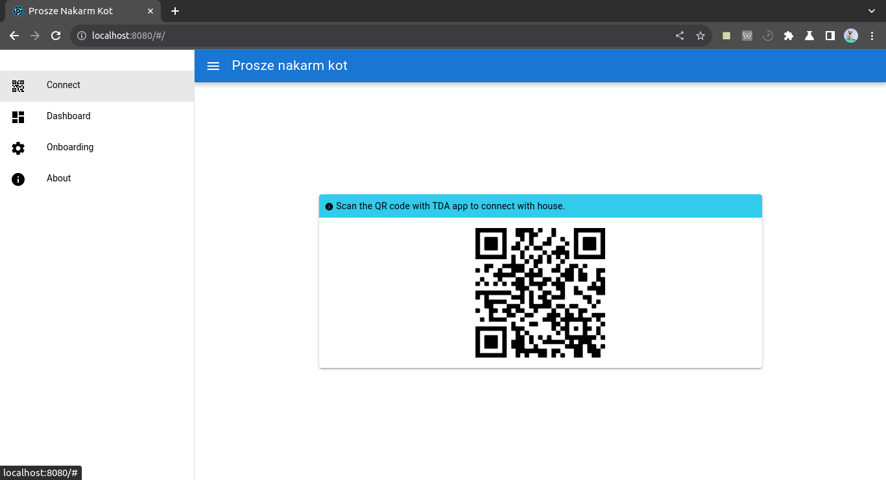
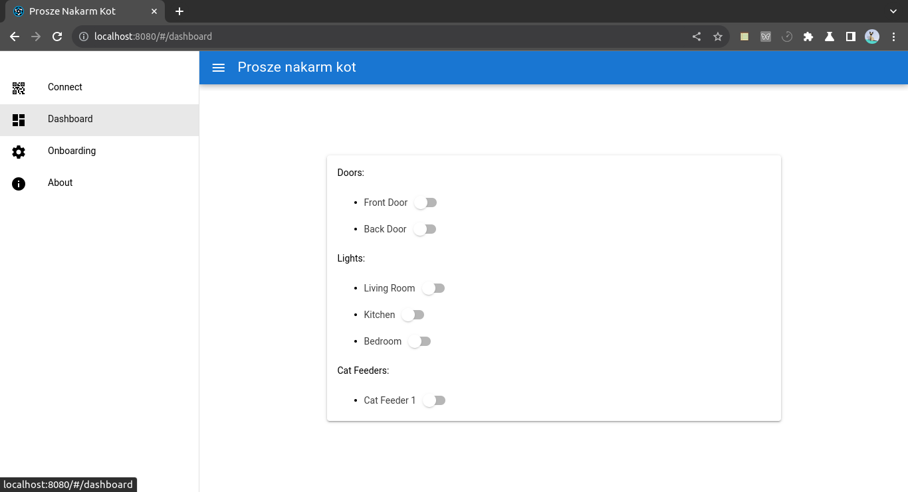
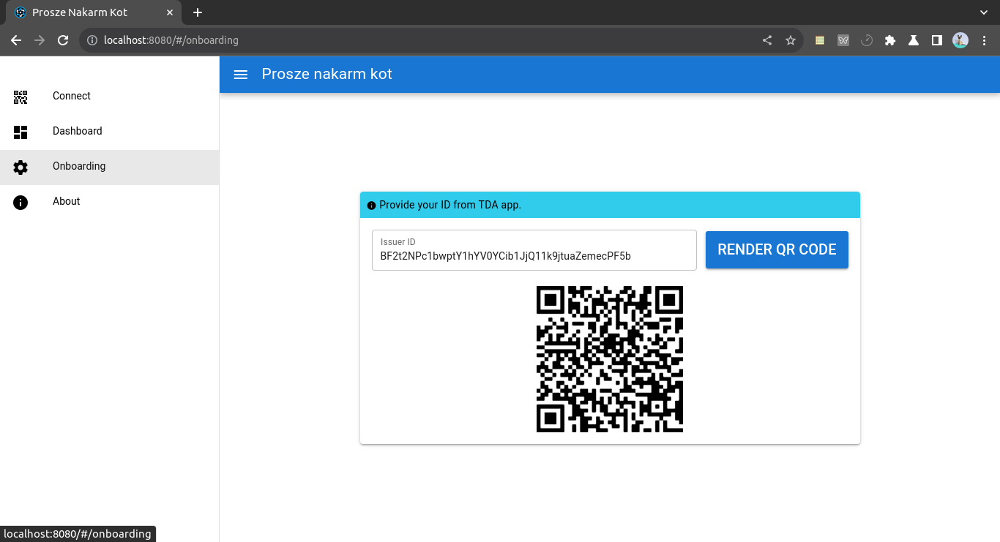

# Prosze Nakarm Kot (prosze-nakarm-kot-frontend)

A Quasar Framework app

## Install the dependencies

```bash
yarn
```

### Start the app in development mode (hot-code reloading, error reporting, etc.)

```bash
quasar dev
```

### Build the app for production

```bash
quasar build
```

## Screenshots




